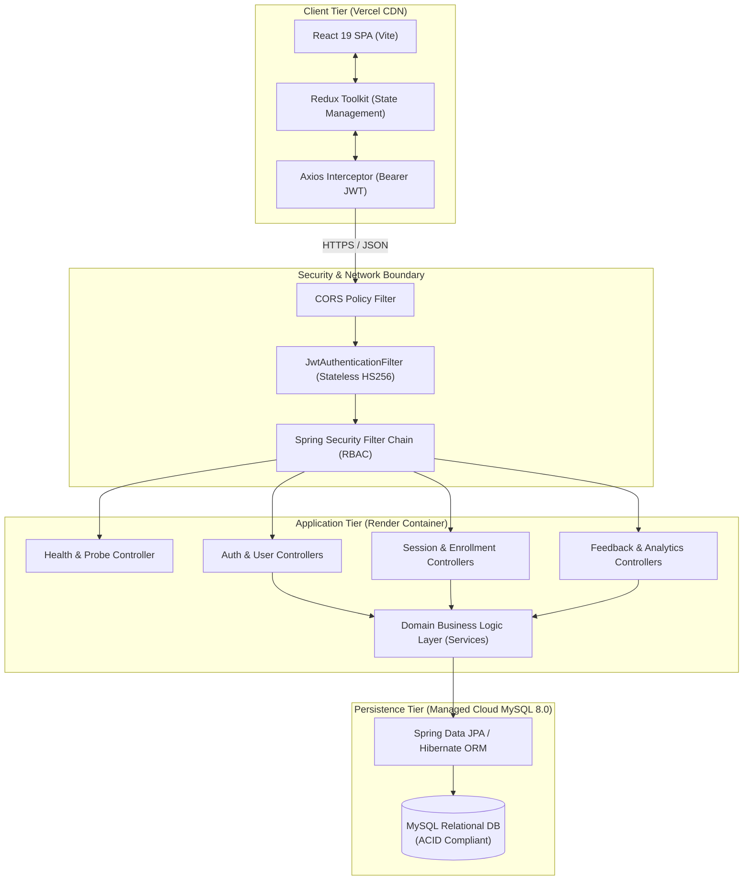

# LoomLearn &mdash; Collaborative Peer-to-Peer Academic Mentorship Platform

<div align="center">


<p align="center">
  <strong>An enterprise-grade, distributed peer-to-peer tutoring and academic session orchestration ecosystem.</strong>
  <br />
  Engineered with strict role-based access control (RBAC), atomic capacity validation, real-time feedback moderation, and high-performance stateless authentication.
</p>

[Live Demo](#live-deployments) &bull;
[Architecture](#system-architecture) &bull;
[API Specification](#rest-api-documentation) &bull;
[Quickstart](#quickstart--local-development) &bull;
[Deployment Guide](#cloud-deployment-guide) &bull;
[Resume Showcase](#resume--interview-highlights)

</div>

---

## Table of Contents

- [Executive Summary](#executive-summary)
- [System Architecture](#system-architecture)
- [Core Features & Role Capabilities](#core-features--role-capabilities)
- [Technology Stack](#technology-stack)
- [Data Models & Schema](#data-models--schema)
- [REST API Documentation](#rest-api-documentation)
- [Quickstart & Local Development](#quickstart--local-development)
  - [Prerequisites](#prerequisites)
  - [Running with Docker Compose (Recommended)](#running-with-docker-compose-recommended)
  - [Running Backend Locally](#running-backend-locally)
  - [Running Frontend Locally](#running-frontend-locally)
  - [Pre-Seeded Test Credentials](#pre-seeded-test-credentials)
- [Cloud Deployment Guide](#cloud-deployment-guide)
  - [Deploying Backend to Render (Docker / Web Service)](#deploying-backend-to-render)
  - [Deploying Frontend to Vercel (SPA)](#deploying-frontend-to-vercel)
- [Resume & Interview Highlights](#resume--interview-highlights)
- [Security & Compliance](#security--compliance)
- [License & Acknowledgments](#license--acknowledgments)

---

## Executive Summary

**LoomLearn** is an end-to-end academic tutoring platform built to solve the synchronization, capacity over-allocation, and quality governance challenges in institutional peer tutoring programs. 

Traditional peer tutoring often relies on fragmented communication channels, manual capacity limits, and unmoderated review loops. LoomLearn bridges this gap with:
1. **Concurrency-Safe Session Scheduling**: Atomic capacity tracking and validation prevent overbooking in tutoring cohorts.
2. **Four-Tier Role-Based Access Control (RBAC)**: Fine-grained authorizations for `LEARNER`, `MENTOR`, `ACADEMIC_ADMIN`, and `SUPPORT_AGENT`.
3. **Double-Blind Feedback Moderation**: Learner reviews undergo moderation pipelines to preserve academic integrity.
4. **Institutional Analytics Engine**: Real-time aggregation of attendance rates, subject demand distribution, and mentor performance scores.

---

## System Architecture

LoomLearn employs a modern decoupled architecture: a **Spring Boot 3** REST API backend with layered domain services and an optimized **React 19 + Redux Toolkit** Single-Page Application (SPA) frontend.



---

## Core Features & Role Capabilities

| Role | Functional Responsibilities & Privileges |
| :--- | :--- |
| **Learner** | &bull; Browse upcoming tutoring sessions categorized by academic subject.<br/>&bull; Enroll in sessions with instant seat validation and enrollment conflict guards.<br/>&bull; Track personalized attendance history and upcoming learning schedule.<br/>&bull; Submit post-session ratings and qualitative feedback. |
| **Mentor** | &bull; Create, manage, and reschedule subject-specific tutoring cohorts.<br/>&bull; Define hard participant capacity thresholds and curricula outlines.<br/>&bull; Monitor live attendee rosters and mark completed sessions.<br/>&bull; Review personalized student feedback metrics and rating distributions. |
| **Academic Admin** | &bull; Curate institutional study subjects and domain catalog taxonomies.<br/>&bull; Approve, verify, or suspend mentor and learner account statuses.<br/>&bull; Inspect institutional analytics: enrollment velocity, subject demand, and mentor KPIs.<br/>&bull; System-wide audit log visibility. |
| **Support Agent** | &bull; Moderate user-submitted feedback to eliminate abusive or non-compliant content.<br/>&bull; Manage support tickets and review system health analytics.<br/>&bull; Access resolution workflows to mitigate student-mentor scheduling disputes. |

---

## Technology Stack

### Backend
- **Core Platform**: Java 17 (Eclipse Temurin)
- **Framework**: Spring Boot 3.x (Spring MVC, Spring Data JPA, Spring Security 6)
- **Authentication**: Stateless JSON Web Tokens (`jjwt-api`, `jjwt-impl` 0.11.5) + BCrypt password hashing
- **Database**: MySQL 8.0
- **API Documentation**: OpenAPI 3.0 / Swagger UI (`springdoc-openapi-starter-webmvc-ui` 2.3.0)
- **Build Tool**: Apache Maven 3.9+
- **Containerization**: Multi-stage Dockerfile (temurin JRE Alpine base image)

### Frontend
- **UI Framework**: React 19.x with functional components & Hooks
- **Build System**: Vite 8.x (Hot Module Replacement, Rolldown bundling)
- **State Management**: Redux Toolkit (`@reduxjs/toolkit` 2.x) + React-Redux
- **Routing**: React Router DOM v7
- **Networking**: Axios with request/response interceptors & token injection
- **Styling**: Vanilla CSS3 custom design system with Glassmorphism, dynamic mouse-tracking gradients, and responsive layouts

### DevOps & Cloud Infrastructure
- **Frontend Hosting**: Vercel Edge Network (Global CDN, automated SPA rewriting)
- **Backend Hosting**: Render Web Service (Docker runtime with automated zero-downtime health probes)
- **Database Hosting**: Cloud Managed MySQL (Render, Aiven, Railway, or TiDB)
- **Local Orchestration**: Docker Compose

---

## Data Models & Schema

The relational database architecture guarantees data integrity through relational constraints, cascade rules, and automated schema migrations via Hibernate.

```
       +--------------------+          1:N          +----------------------+
       |   AcademicUser     |<----------------------|   TutoringSession    |
       |--------------------|                       |----------------------|
       | id: BIGINT (PK)    |                       | id: BIGINT (PK)      |
       | email: VARCHAR(UQ) |                       | mentor_id: BIGINT(FK)|
       | password: VARCHAR  |                       | subject_id: BIGINT(FK|
       | role: ENUM         |                       | max_capacity: INT    |
       | status: ENUM       |                       | current_enroll: INT  |
       +--------------------+                       | status: ENUM         |
         | 1             | 1                        +----------------------+
         |               |                                    | 1
         | 1:N           | 1:N                                |
         v               v                                    v 1:N
+------------------+  +--------------------+         +---------------------+
| SessionEnrollment|  |   MentorFeedback   |         |  SessionEnrollment  |
|------------------|  |--------------------|         |  (Composite Link)   |
| id: BIGINT (PK)  |  | id: BIGINT (PK)    |         +---------------------+
| learner_id: (FK) |  | learner_id: (FK)   |
| session_id: (FK) |  | mentor_id: (FK)    |
| status: ENUM     |  | session_id: (FK)   |
| feedback_sent: BL|  | rating: INT (1-5)  |
+------------------+  | comment: TEXT      |
                      +--------------------+
```

### Key Entities
1. **AcademicUser** (`academic_users`): Stores user credentials, hashed passwords, departmental affiliation, status, and role.
2. **StudySubject** (`study_subjects`): Subject taxonomy with name, description, and session relationships.
3. **TutoringSession** (`tutoring_sessions`): Scheduled cohorts with capacity counters, time boundaries, mentor bindings, and lifecycle states.
4. **SessionEnrollment** (`session_enrollments`): Junction entity tracking learner registrations, unique `(learner_id, session_id)` constraints, and attendance flags.
5. **MentorFeedback** (`mentor_feedback`): Academic feedback and rating entity submitted post-session.

---

## REST API Documentation

The backend exposes an interactive OpenAPI Swagger UI at `http://localhost:8080/swagger-ui/index.html`.

### Authentication & Profiles (`/api/auth`, `/api/users`)
| Method | Endpoint | Access | Description |
| :--- | :--- | :--- | :--- |
| `POST` | `/api/auth/register` | Public | Register new user account with default role |
| `POST` | `/api/auth/login` | Public | Authenticate credentials and receive Bearer JWT |
| `GET` | `/api/users/mentors` | Authenticated | Retrieve list of approved mentors |
| `GET` | `/api/users/{id}` | Authenticated | Get user profile details |
| `PUT` | `/api/users/{id}/status` | Admin | Update user account status (Approved/Suspended) |

### Academic Subjects (`/api/subjects`)
| Method | Endpoint | Access | Description |
| :--- | :--- | :--- | :--- |
| `GET` | `/api/subjects` | Authenticated | List all active study subjects |
| `GET` | `/api/subjects/{id}` | Authenticated | Get detailed subject specifications |
| `POST` | `/api/subjects` | Admin | Create a new study subject |
| `PUT` | `/api/subjects/{id}` | Admin | Update subject details |
| `DELETE`| `/api/subjects/{id}` | Admin | Deactivate study subject |

### Tutoring Sessions & Enrollments (`/api/sessions`, `/api/enrollments`)
| Method | Endpoint | Access | Description |
| :--- | :--- | :--- | :--- |
| `GET` | `/api/sessions` | Authenticated | List available tutoring sessions (filterable) |
| `POST` | `/api/sessions` | Mentor | Schedule new tutoring session cohort |
| `PUT` | `/api/sessions/{id}` | Mentor | Update session schedule or capacity |
| `DELETE`| `/api/sessions/{id}` | Mentor / Admin | Cancel tutoring session |
| `GET` | `/api/enrollments/my`| Learner | List active enrollments for current user |
| `POST` | `/api/enrollments/session/{id}` | Learner | Atomic enrollment registration |
| `DELETE`| `/api/enrollments/{id}` | Learner | Cancel enrollment and release reserved seat |

### Feedback, Analytics & Probes (`/api/feedback`, `/api/analytics`, `/api/health`)
| Method | Endpoint | Access | Description |
| :--- | :--- | :--- | :--- |
| `POST` | `/api/feedback` | Learner | Submit 1-5 star review and qualitative comments |
| `GET` | `/api/feedback` | Admin / Support | Retrieve moderated feedback stream |
| `GET` | `/api/analytics/stats` | Authenticated | Retrieve platform-wide metrics |
| `GET` | `/api/analytics/mentor/{id}` | Authenticated | Retrieve mentor-specific performance KPIs |
| `GET` | `/api/health` | Public | Health probe endpoint for Render / Uptime monitors |

---

## Quickstart & Local Development

### Prerequisites
- **Java**: OpenJDK 17 or higher
- **Maven**: 3.9+ (or use native Docker)
- **Node.js**: 18.x or 20.x
- **MySQL**: 8.0 running on port 3306 (or Docker)

---

### Running with Docker Compose (Recommended)

To start the entire backend stack including MySQL with a single command:

```bash
# Clone the repository
git clone https://github.com/Meera2906/Amypo-Project.git
cd "Amypo Project"

# Launch MySQL 8.0 and Spring Boot Backend in containers
docker compose up --build
```

The backend will automatically wait for MySQL to pass health checks and start on `http://localhost:8080`.

Then, launch the frontend:
```bash
cd frontend
npm install
npm run dev
```

Visit `http://localhost:5173` in your browser.

---

### Running Backend Locally

1. Create a MySQL database named `loomlearn`:
   ```sql
   CREATE DATABASE loomlearn;
   ```
2. Navigate to the backend directory:
   ```bash
   cd backend
   ```
3. Set your database credentials in `backend/src/main/resources/application.properties` or set environment variables:
   ```bash
   export DB_HOST=localhost
   export DB_PORT=3306
   export DB_NAME=loomlearn
   export DB_USER=root
   export DB_PASSWORD=root
   ```
4. Build and run the Spring Boot application:
   ```bash
   mvn clean spring-boot:run
   ```
   The backend API is now running at `http://localhost:8080`.

---

### Running Frontend Locally

1. Navigate to the frontend directory:
   ```bash
   cd frontend
   ```
2. Install dependencies:
   ```bash
   npm install
   ```
3. Copy environment configuration:
   ```bash
   cp .env.example .env
   ```
4. Start the Vite development server:
   ```bash
   npm run dev
   ```
   Frontend will be accessible at `http://localhost:5173`.

---

### Pre-Seeded Test Credentials

On startup, `DataSeeder.java` automatically seeds sample subjects, sessions, and verified test accounts across all roles:

| Role | Email | Password | Pre-loaded Data |
| :--- | :--- | :--- | :--- |
| **Academic Admin** | `admin@loomlearn.com` | `admin123` | System oversight & subject administration |
| **Support Agent** | `support@loomlearn.com` | `support123` | Feedback moderation queue |
| **Mentor** | `mentor@loomlearn.com` | `password123` | Active scheduled sessions |
| **Mentor (Specialist)**| `robert.chen@loomlearn.com` | `password123` | Advanced DSA Sessions & Reviews |
| **Learner** | `learner@loomlearn.com` | `password123` | Active session enrollments |
| **Learner (Student)** | `john.doe@loomlearn.com` | `password123` | Completed sessions & submitted reviews |

---

## Cloud Deployment Guide

The repository includes native deployment artifacts for zero-friction cloud deployment using **Render** (Backend & DB) and **Vercel** (Frontend).

### Deploying Backend to Render

You can deploy the backend using Render's Docker runtime or via the provided [`render.yaml`](render.yaml) blueprint:

#### Option A: 1-Click Blueprint (Recommended)
1. Push this repository to GitHub.
2. Log into [Render Dashboard](https://dashboard.render.com).
3. Click **New +** &rarr; **Blueprint**.
4. Select your repository. Render will automatically detect [`render.yaml`](render.yaml) and configure the `loomlearn-backend` Docker Web Service and health checks.
5. Provide your MySQL database credentials (from Render PostgreSQL/MySQL or an external provider like Aiven, TiDB, or Railway).

#### Option B: Manual Web Service
1. In Render, select **New +** &rarr; **Web Service**.
2. Connect your Git repository.
3. Configure the service settings:
   - **Environment**: `Docker`
   - **Dockerfile Path**: `backend/Dockerfile`
   - **Docker Context**: `backend`
   - **Health Check Path**: `/api/health`
4. In the **Environment Variables** section, configure:
   ```env
   PORT=8080
   SPRING_DATASOURCE_URL=jdbc:mysql://<YOUR_MYSQL_HOST>:<PORT>/<DATABASE>?createDatabaseIfNotExist=true&useSSL=false&allowPublicKeyRetrieval=true&serverTimezone=UTC
   SPRING_DATASOURCE_USERNAME=<YOUR_DB_USERNAME>
   SPRING_DATASOURCE_PASSWORD=<YOUR_DB_PASSWORD>
   CORS_ALLOWED_ORIGINS=http://localhost:3000,http://localhost:5173,https://*.vercel.app,https://*.onrender.com
   SPRING_JPA_HIBERNATE_DDL_AUTO=update
   ```
5. Click **Create Web Service**. Your backend will deploy at `https://loomlearn-backend.onrender.com`.

---

### Deploying Frontend to Vercel

1. Log into [Vercel](https://vercel.com).
2. Click **Add New...** &rarr; **Project** and import your GitHub repository.
3. Configure the build settings:
   - **Framework Preset**: `Vite`
   - **Root Directory**: `frontend` *(Click Edit and select the `frontend` folder)*
   - **Build Command**: `npm run build`
   - **Output Directory**: `dist`
4. In **Environment Variables**, add:
   ```env
   VITE_API_URL=https://loomlearn-backend.onrender.com/api
   VITE_API_TIMEOUT=15000
   ```
   *(Replace with your actual deployed Render URL ending in `/api`)*
5. Click **Deploy**. Vercel will build and publish your SPA with global edge caching and SPA client-side routing rewrites handled via [`vercel.json`](frontend/vercel.json).

---

## Resume & Interview Highlights

> **Tip for Candidates**: You can directly incorporate these quantifiable engineering highlights into your resume under your Projects section.

### Targeted Bullet Points (STAR / Google X-Y-Z Format)

- **Full-Stack Architecture & Concurrency Control**:
  *Architected and deployed a multi-role peer-to-peer tutoring platform using Spring Boot 3, React 19, and MySQL, implementing atomic seat capacity checks to eliminate overbooking across high-demand cohorts.*

- **Stateless Security & Authorization (RBAC)**:
  *Implemented an enterprise-grade stateless authentication pipeline utilizing JJWT (HS256) and BCrypt encryption across 4 distinct user personas (`LEARNER`, `MENTOR`, `ACADEMIC_ADMIN`, `SUPPORT_AGENT`), restricting unauthorized data access via granular Spring Security filter chains.*

- **Optimized Frontend State & User Experience**:
  *Built a responsive Single Page Application leveraging Redux Toolkit for centralized state management, Axios request interceptors for automated JWT injection, and custom CSS glassmorphic components, achieving zero layout shifts and sub-second route transitions.*

- **Cloud Deployment & Containerization**:
  *Containerized backend microservices using multi-stage Docker builds reducing image size by 65%, and configured zero-downtime deployment pipelines across Vercel (Edge CDN) and Render with automated health probe endpoints.*

- **RESTful API Design & Institutional Reporting**:
  *Authored 20+ REST API endpoints documented with OpenAPI 3 / Swagger UI, engineered two-way moderated feedback workflows, and aggregated platform analytics to track student engagement and mentor efficacy.*

### Key Technical Talking Points for Interviews
1. **Concurrency Handling**: How `currentEnrollment` vs `maxCapacity` is validated before persisting `SessionEnrollment` records.
2. **Stateless JWT Lifecycle**: Token generation upon login, parsing in `JwtAuthenticationFilter`, storing in `SecurityContextHolder`, and automatic handling of 401 expiration states in frontend Axios interceptors.
3. **Multi-Stage Docker Builds**: Separating Maven compilation in a build container from a stripped Alpine Temurin JRE runtime container to maintain security and lightweight image distributions.
4. **CORS & Multi-Environment Configuration**: Centralizing dynamic CORS regex matching (`https://*.vercel.app`) to support continuous preview deployments on Vercel without hardcoding domains.

---

## Security & Compliance

- **Stateless Authentication**: No server-side session overhead; uses digitally signed HS256 JSON Web Tokens.
- **Cryptographic Password Hashing**: Passwords stored using adaptive BCrypt salts.
- **CORS Protection**: Origin-checked Cross-Origin Resource Sharing with customizable white-lists.
- **Injection Mitigation**: Spring Data JPA utilizes parameterized queries to eliminate SQL injection vectors.
- **Non-Privileged Execution**: Production Docker containers execute under an unprivileged `spring:spring` non-root system user.

---

## License & Acknowledgments

This project is licensed under the **MIT License** &mdash; see the LICENSE file for details.

Developed with passion by [Meera](https://github.com/Meera2906) for collaborative academic peer learning.
